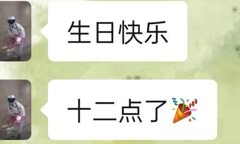
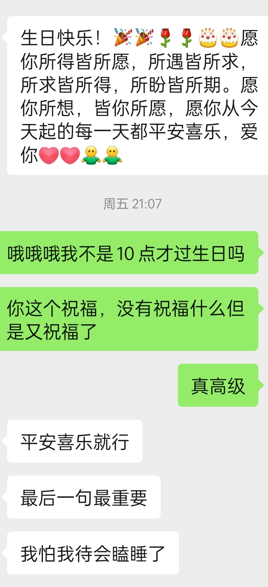

   阴雨连天的十月，我的二十二岁到来了。昨天和人回想起来，大学以来的每个奇数的生日前后，总是发生了一些不那么愉快的事情。比如：18岁的难忘呕吐日，20岁的难忘摔跤日，和今年，过敏日。而且似乎今年种种事情都不是很顺利，如果把恰好还有好运考上研究生作为好事，那大概是我所求的实现了吧：把一切的好运换做我还有学上。

​    新的生日，如愿以偿地吃到了想吃的蛋糕，拥有了超丰盛的生日大餐，吃到了想吃的菜，土豆片、炒肉。

每次这种时候就觉得，似乎什么事情都会好起来，被周围的爱意包裹着。比如收到年年年都有的家人，和挚友和朋友们的祝福之外，还有一个没有想到的朋友的祝福。

​    我要对即将到来的未来做什么规划吗。我还有几天的时间才要继续上课，在宿舍里窝着好几天的时间似乎还可以思考。

​    我最近总是想起来过去，过去如何如何。新的一岁到了，希望我想要的都能未来在某个时间地点与我相遇，就像我收到的瓜怡说的那样。她居然能记住我要调参什么的哈哈。

​    我已经不太在意真诚什么的了，或者以物换物，前些天还在纠结这个。今天突然就觉得，只要我所爱的人和爱我的人一直在身边就好了。

​    希望二十二岁的当当可以成为想要成为的人。

