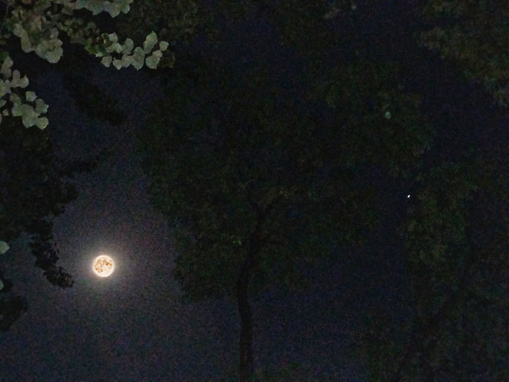
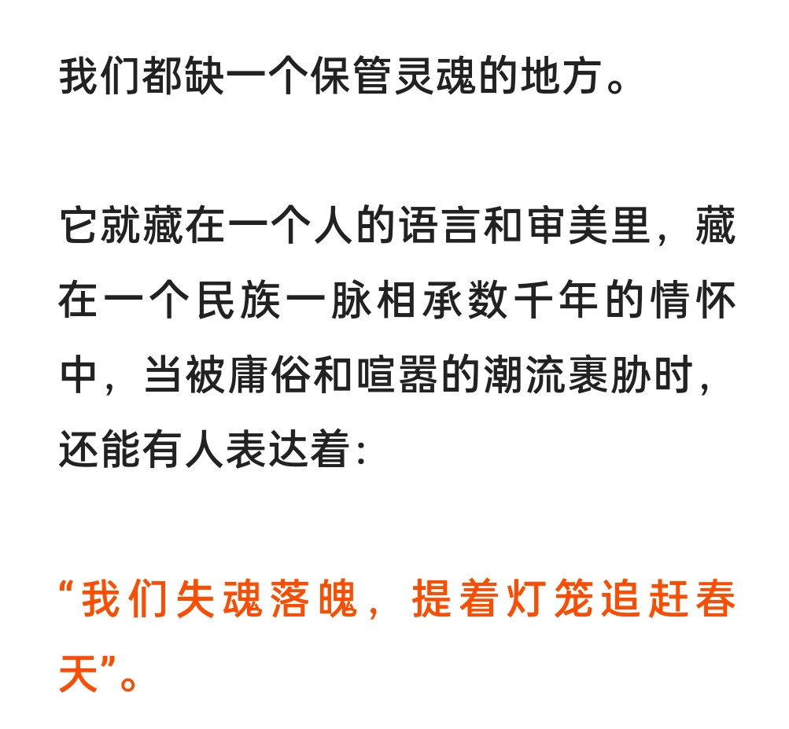

”**一切都会好起来的对吧，如果外界没有光，那就至少在自己和周围感受光，成为光。**“

  我是在去年看那些长篇累牍的没有灵魂的文字时，头一次产生了厌倦文字的感觉。是反复拉起的封闭线，是反复收到的喜欢吃的餐厅停业的消息的时候，是出门买药，买水果，一次次填报表格的时候，是看电视剧看到别人出去玩第一反应是那里难道没有疫情，而想起来这是十年前的电视剧的时候。是成日呆在小屋里的时候，觉得时间慢慢的褪色了。

  我越来越爱在天空底下待很久，想去看看外面，甚至于那天在夜半跑出去照月亮。因为在宿舍看到月亮那么费劲，而我想亲眼看看它的美，更想留住月光。

我怀念回不去的过往，更向往不久以后的未来会是什么样的。

  微博的话题，越来越没有意义。甚至可以说，整个世界现在都走向了我看不懂的方向。昨晚看到一篇文章，就现在汉语用语的不规范，信息庞杂而无意义提出了抨击。我们是否失去了发现美，感受美的能力。美蕴含在各种东西里，美景，音乐，感人肺腑的电影，古人工整潇洒的诗词歌赋。人总要在无聊的生活里找到什么。

  生命之所以区别于无机物，人之所以区别于其他生物，就在于灵魂。在当代机器可以替代很多工作的状况下，人不可替代的就是灵魂，是对世间万物的触碰，是对美的感知，是对时空中事物建立带有个性色彩的认知。是对所从事所观测世界赋予一份爱，而不是像机器一样运作。

  只有在最近看其他书看不进去，而一点点搞懂矩阵的时候，才觉得，或许也确实没有做错选择。于是，时间也没有那么难熬了。

  想知道的东西还有很多，生命的秘密，宇宙的深邃，经济的发展，历史的缝隙。终于有这样的时间了，就像那天别人说的，享受现在吧。

