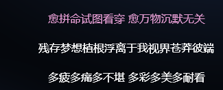

距离我的手术已经过去很久很久了，我又可以在阳光下跑步，又可以四处瞎转。快要放假了，写一个阶段性的总结。

​		首先是，这么就一路走来，确实靠着一种奇怪的意志力，现在看来，好像过去的三个月并不算什么，疼痛似乎也想不起来了。心理上的问题再回到学校自己带着以后好多了，也是又重新回到喜欢的人身边，重新看了一些书以后吧，逐渐就好了。

​		想给这几个月玩的游戏写一个repo

## Ori

​		在撞伤的最初，和11月最后面的一段时间，在某人的陪伴下，把奥日打完了。

​		现在还是能想起来那一段音乐，在奥日在风中前行，在幽暗的森林里面前行的时候，一直萦绕耳边的音乐。

​		这个游戏确实一开始玩的我挺崩溃的，因为我总是找不到路，还总是死掉。不过后面好多了。奥日教会我的大概就是，人需要勇敢的面对事情。从某人打游戏中我学会的就是，需要对事情有耐心，如果没有耐心的话，什么都做不下去的。去勇敢的面对世界，相信自己的微笑的力量，绝望的时候，也不要恐惧黑暗，总能走出去的。沉溺于这个游戏的美丽景色，光影浮动的效果，和应景的配乐。但是，和玩其他游戏一样，我确实非常的不喜欢，阴暗和红色的色调。

## To The Moon

​		十一月的月底下的游戏。这段时间的我，正处于积极的锻炼，每天都想要有进步的时间段。因为听了一首歌《β受体阻断剂与星辰》，歌词是这样的。

​		那段时间和那段时间之前，发生了很多事情。歌单也曾经变得奇奇怪怪，但是最终还是删掉了自己那个名为`dust`的歌单，然后开始听一些积极乐观的东西。我不想再继续嵌在这个空房间。说是忘记了什么，其实是那段时间自己不敢想，不知道做什么是对的了。打开这个游戏还没有玩儿多久，听见了For river那个曲子，突然就哭了。只有简单的两个音符，一个躺在床上的老人，我大概就知道这个故事发生了什么。大概是爱情，给River的回忆。后面，发现了这个故事比我想象的要复杂的多，表达的东西也要多得多。

​		有着斯伯格综合征的River，被注射了记忆阻断剂的John。嘉年华那天，再游乐园完了以后，两个小孩坐在等他旁边，River说星星就像是一座座灯塔，虽然他们无法交谈，但仍然努力的发着光，照耀彼此。Johnny指着天上的星星，说它们可以连成小兔子。相约明年再见，这时River问“如果你忘记了……或者走丢了呢？ ——“那么我们总会在月亮上相遇的的，傻瓜！” 

​		于是，在后来的那些年，River一直执着地折纸，希望唤起John儿时的记忆。River至死也没有能唤醒Johnny的记忆，但是，大约是，那个约定，对我来说，更多的是爱的信念和力量，冲破了β-阻滞剂的区段，最终，即使没有想起过往，Johnny最强烈的的愿望，仍然留存在他的大脑里——“我想去月球”。 于是，在被修改的记忆里面，他们最后是一起在NASA工作的科学家，一起乘着火箭去了月球。故事在这里，就结束了。一直伴随着游戏的心脏监护仪的声音也停止了，片尾又是To The Moon，然后我又在库，这样一生的爱情。哪怕忘记了我们的过去，再次相见的时候，还是重新的·爱上了你。而另一方则是，忘记了我们的过去也没有关系，我会一遍一遍的给你讲，过去，重新认识你。

​		这个故事另一个戳到我地方就是，River的病。理解，不理解，交流与不交流，刻板和重复的行为。没有人想要接近。总感觉，有一个我是那样的，那个不太正常的我。所以，在这其中的很多时候，我回想起我自己画下的那些画，所以大概也是因为这难过。也因为这样她又那样的John爱着，为那样的爱情，流泪。

## 底特律：变人

​		一个玩儿了很久很上头的游戏，每一个选择都会影响到故事的最终发展。对于选择困难症的我，屏幕上选项的倒计时确实一定程度治好了我的犹豫不决，因为不做选择系统就会给出我不想要的结果。

​		卡尔是我遇见的善良的艺术家，我对马库斯和卡尔的线感触最深。秋天，金黄的树叶，马库斯走在街道上，去给卡尔购买颜料。在其中，遇到了人类对于仿生人的集群抗议。人类认为仿生人挤占了他们的生活空间，工作机会。我在思考，这究竟是怎样的。这就是我们究竟将仿生人当作新的物种还是一种工具。不过，即便是工具，劳动者对于极大提升生产力的工具也是充满着畏惧和一定程度的不满。试想在工业革命的初期，工人对大规模生产机器的畏惧，今时今日大家对被AI替代的畏惧，我觉得都是类似的。

​		再就是后面的耶利哥革命线和卡拉逃亡线。个人与全局，冷酷还是同情，信任还是警惕，在这个游戏里面得到了极致的展现。过于轻信别人，就会导致被拉入深渊，伸出的援手不一定是善意的，你对别人伸出的援手，也可能让你更加万劫不复。想要济世，就得放下自己。想要善待这个世界，一味的低头，并不能换来所谓的同情，反而会被人当作可以欺负的对象，任人宰割。而上一秒看似支持你的人，可能因为你触及了他的某一部分利益，转身卖掉你。永远看不清人脸背后真实的人性。

​		最后我还是带领着大家革命成功，甚至策反了康纳。康纳主要的故事都适合安德森警督展开的。在这里，我也学到了一个教训，千万不要一味的去讨好别人，以为你根本不知道别人到底是什么态度。（安德森并不仇恨仿生人，但是对于那些自以为是，勾心斗角的人类十分厌恶，表达出自己的内心想法，比去试图以“仿生人辅助者”的低姿态讨好人类，要来的好得多。我也因此吧有些章节给重新玩了）所以，在最后的大结局，我的警督和康纳拥抱，警督说 my son，那一刻，两个人都完成了人性的救赎，这应该才是这个故事的意义吧。

